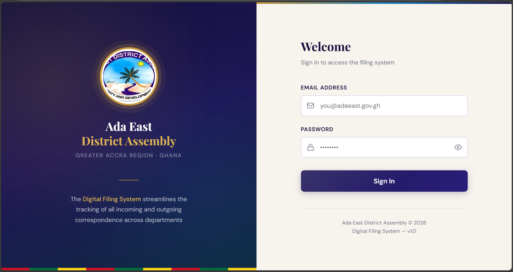
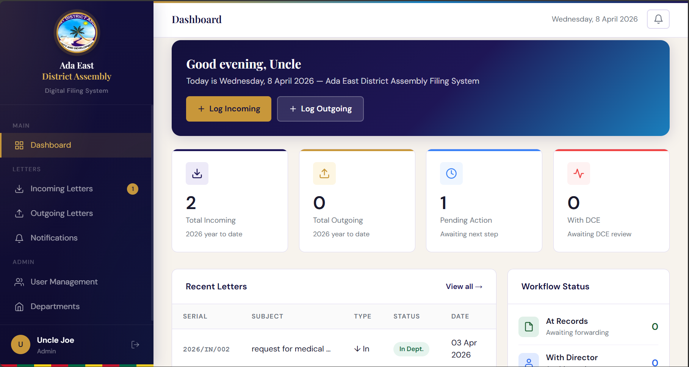
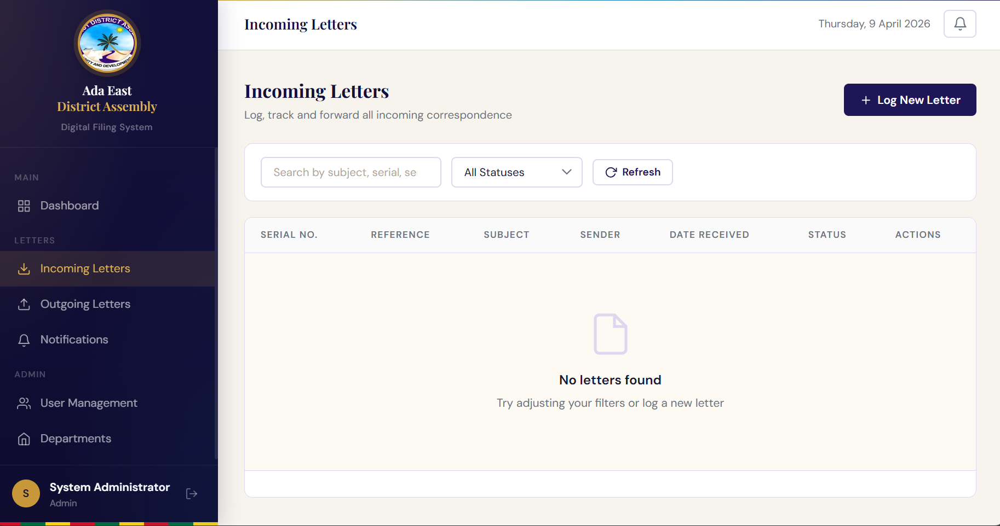
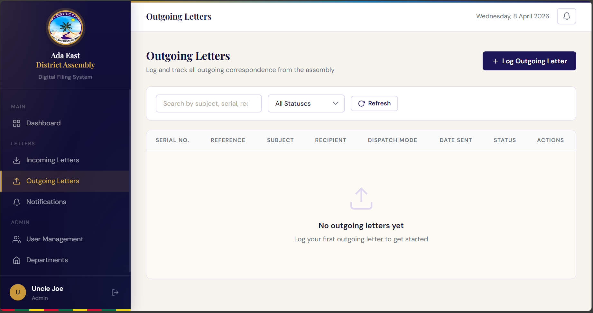
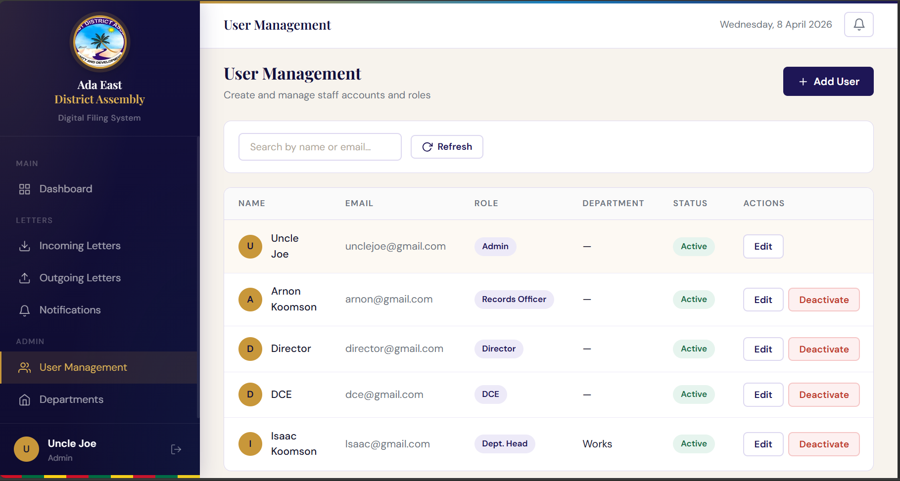
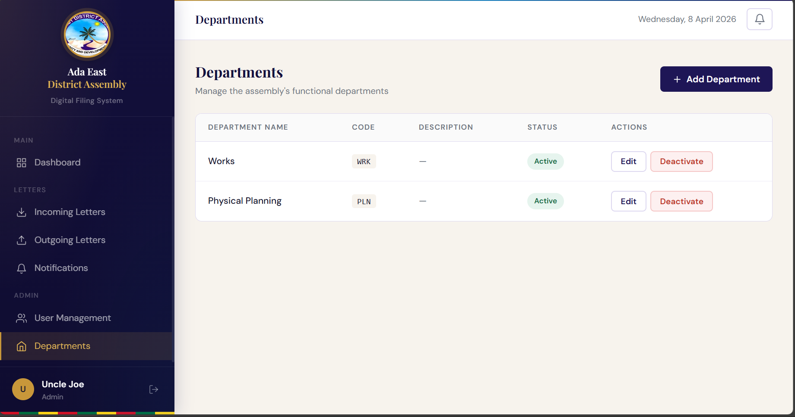
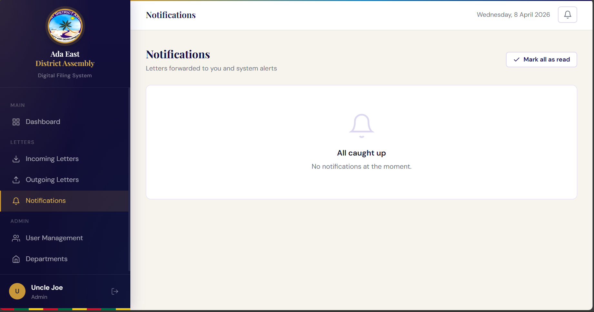

# Ada East Digital Filing System

A full-stack web application for managing incoming and outgoing official letters for the Ada East District Assembly.

## Project Overview

This system digitizes letter tracking across the full workflow, from records intake to the director and DCE review, department dispatch, and closure.

## Tech Stack

- Backend: FastAPI, SQLAlchemy, JWT authentication
- Database: SQLite (development) or PostgreSQL (production)
- Frontend: HTML, CSS, vanilla JavaScript

## Features

- **User Authentication**: Secure login with JWT tokens and role-based access control (Admin, Records Officer, Department Head, The DCE, The Director)
- **Incoming Letters**: Log and track received official letters with picture or PDF uploads and status management
- **Outgoing Letters**: Create and manage outgoing letters with serialization and dispatch tracking
- **Department Management**: Organize letters by destination or originating department
- **User Management**: Create and manage system users with different roles and permissions
- **Notifications**: Automatic notifications for letter movements and status updates
- **Dashboard**: Overview of system activity with quick access to all main functions
- **Digital Storage**: Centralized PDF storage for all incoming and outgoing letters
- **Serial Number Generation**: Automatic unique serial numbering for outgoing letters

## App Workflow

1. A user logs in with role-based access control.
2. Records staff register incoming letters and upload any attachments.
3. The Director reviews incoming letters and forwards them to the DCE or dispatches them to a department.
4. The DCE can return letters to the Director when needed.
5. Department heads receive dispatched letters, work on them, add a report, and return them to the Director.
6. The Director closes completed letters when the workflow is finished.
7. Users create outgoing letters, assign dispatch details, and mark them as sent.
8. Notifications and audit trails keep track of every action in the system.

## Screenshots

### Login Page


### Dashboard


### Incoming and Outgoing letters



### User Management


### Departments


### Notification



## App Demo Video

[Watch Full App Demo](demo/app-demo.mp4)


## Repository Structure

```
.
├── README.md                         # Main project documentation
├── demo/                             # App demo video files
│   └── .gitkeep
├── styles.css                        # Root-level global styles
├── backend/                          # FastAPI backend application
│   ├── README.md                     # Backend-specific API documentation
│   ├── main.py                       # FastAPI app initialization and routes setup
│   ├── requirements.txt              # Python dependencies
│   ├── seed.py                       # Initial database setup (admin user, departments)
│   └── app/
│       ├── __init__.py
│       ├── core/                     # Configuration, database setup, JWT security
│       │   ├── __init__.py
│       │   ├── config.py             # Environment variables and app settings
│       │   ├── database.py           # SQLAlchemy session and DB initialization
│       │   └── security.py           # JWT token creation and user verification
│       ├── models/                   # SQLAlchemy ORM models (database tables)
│       │   ├── __init__.py
│       │   └── user.py               # User model with roles and departments
│       ├── repositories/             # Data access layer (queries)
│       │   ├── __init__.py
│       │   ├── base.py               # Base repository for common CRUD operations
│       │   ├── department_repo.py    # Department queries
│       │   ├── letter_repo.py        # Letter (incoming/outgoing) queries
│       │   ├── notification_repo.py  # Notification queries
│       │   └── user_repo.py          # User queries and lookups
│       ├── routers/                  # API endpoints (routes)
│       │   ├── __init__.py
│       │   ├── auth.py               # Login and token endpoints
│       │   ├── departments.py        # Department management endpoints
│       │   ├── letters.py            # Letter creation, retrieval, updates
│       │   ├── notifications.py      # Notification endpoints
│       │   └── users.py              # User management endpoints
│       ├── schemas/                  # Pydantic schemas (request/response validation)
│       │   ├── __init__.py
│       │   └── schemas.py            # All request and response data models
│       └── services/                 # Business logic and workflows
│           ├── __init__.py
│           ├── notifications.py      # Notification creation and delivery
│           └── serial.py             # Letter serial number generation
├── uploads/                          # Uploaded letter files storage
│   ├── incoming/                     # Incoming letters uploads
│   └── outgoing/                     # Outgoing letters uploads
├── frontend/                         # HTML, CSS, JavaScript user interface
│   ├── css/                          # Stylesheets (modular CSS architecture)
│   │   ├── components.css            # Reusable UI components (buttons, cards, modals)
│   │   ├── layout.css                # Page layout and grid structure
│   │   ├── login.css                 # Login-specific styles
│   │   └── variables.css             # Color, font, and spacing variables
│   ├── js/                           # JavaScript functionality
│   │   ├── app.js                    # Main app initialization and utilities
│   │   ├── dashboard.js              # Dashboard page logic
│   │   ├── departments.js            # Department management page logic
│   │   ├── incoming.js               # Incoming letters page logic
│   │   ├── letter-detail.js          # Letter details page logic
│   │   ├── login.js                  # Login form and authentication
│   │   ├── notifications.js          # Notifications page logic
│   │   ├── outgoing.js               # Outgoing letters page logic
│   │   ├── profile.js                # User profile page logic
│   │   ├── sidebar.js                # Navigation sidebar toggle
│   │   └── users.js                  # User management page logic
│   └── pages/                        # HTML pages
│       ├── 404.html
│       ├── dashboard.html
│       ├── departments.html
│       ├── incoming.html
│       ├── letter-detail.html
│       ├── login_index.html
│       ├── notifications.html
│       ├── outgoing.html
│       ├── profile.html
│       └── users.html
└── screenshots/                      # UI preview images used in documentation
```

## Quick Start

### 1. Start backend API

```bash
cd backend
pip install -r requirements.txt
copy .env.example .env
python seed.py
uvicorn main:app --reload
```

The backend runs at http://localhost:8000 and docs are at http://localhost:8000/docs. Swagger UI

### 2. Open frontend

Open frontend/pages/login_index.html in a browser (or serve the frontend folder with a static server).

The frontend is currently configured to call:

- http://localhost:8000/api/v1

You can override this at runtime by setting `window.__API_BASE_URL` or the `apiBaseUrl` value in `localStorage` before the app loads.

## Git Setup and Log Cleanup

# Initialize repo and make first commit
git init
git add .
git commit -m "Initial commit"


## API + Workflow Documentation

Detailed backend API and workflow docs are in:

- backend/README.md

## Security Notes Before Production

- Set a strong SECRET_KEY in backend/.env
- Change default seeded admin password immediately
- Restrict CORS allow_origins in backend/main.py
- Never commit backend/.env or local database files

## Roadmap

Planned improvements:

- Automated tests
- CI checks on push
- Docker setup
- Better deployment documentation
